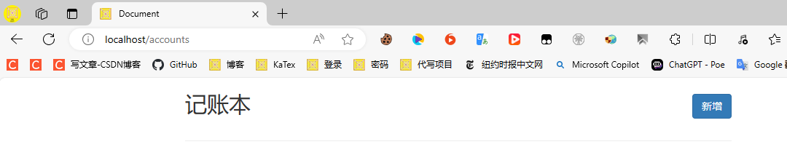
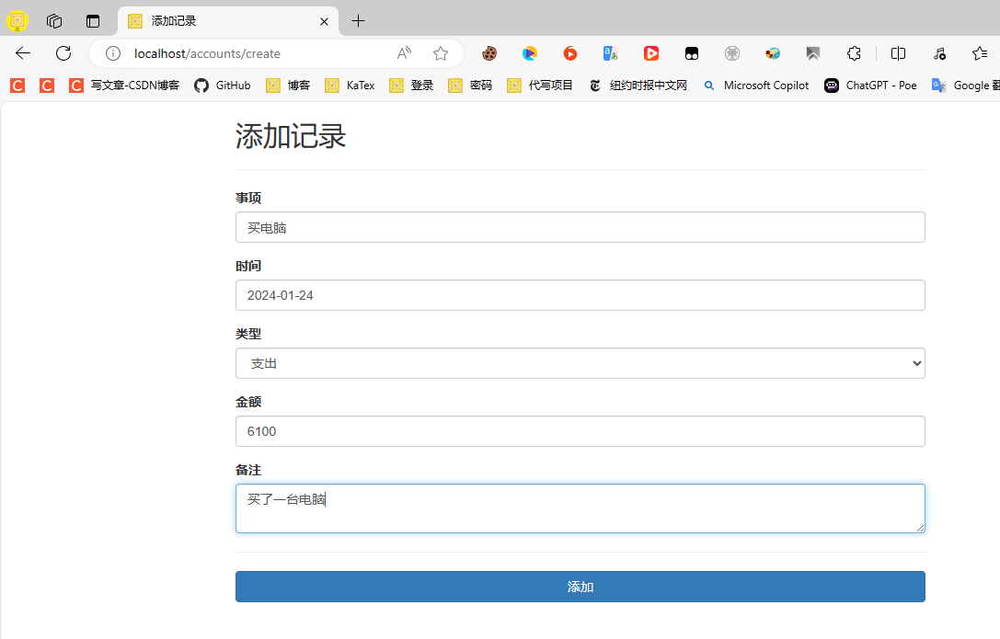
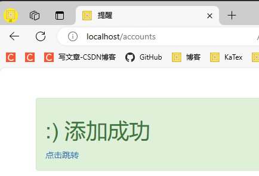
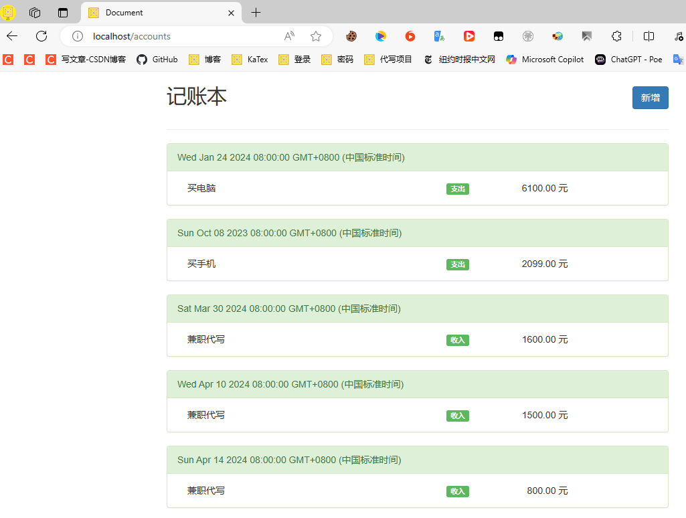
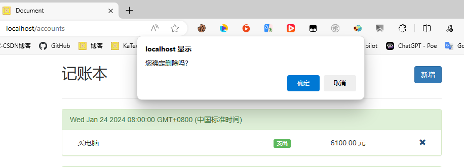
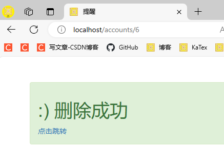
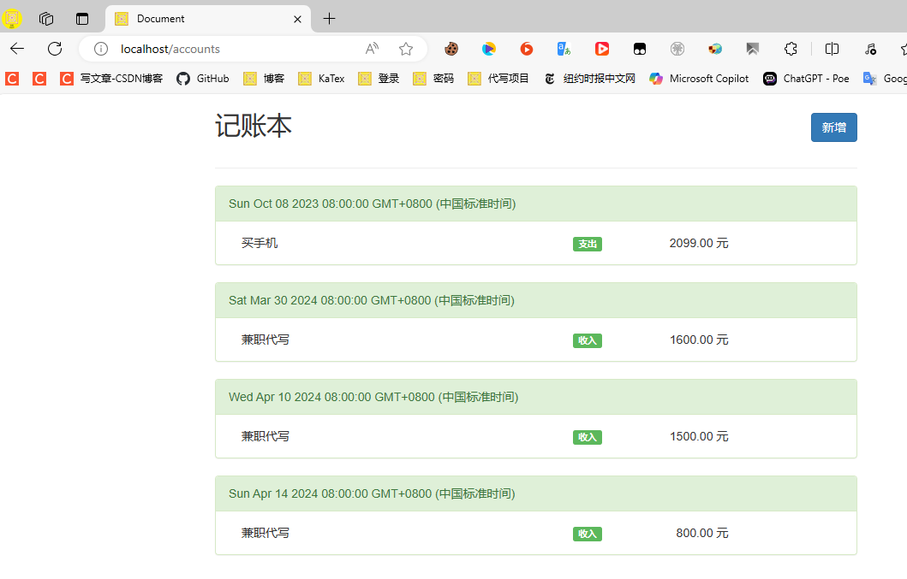

这是一个简单的记账本实现，采用前后端混合的设计方式。  
通过 ejs 模板引擎渲染页面，使用 express 框架搭建服务器，使用 sequelize 操作 MySQL 数据库。  

打开账单页面 http://localhost/accounts  


点击新增进入新增页面  


点击新增后，进入成功提示页面，点击跳转回到账单页面  


多次添加后的账单页面  


每条记录旁边有个删除按钮，点击后可以删除该条记录  


删除成功  


可以看到少了一条记录  



# 测试环境

* Node.js 20.12.2
* MySQL Server：8.2.0

Node.js 模块
```
+-- ejs@3.1.10
+-- express@4.19.2
+-- mysql2@3.9.7
`-- sequelize@6.37.3
```

# 部署

## 数据库

安装 MySQL 并登录数据库控制台，创建一个数据库
```
CREATE DATABASE accounts_db; 
```

## 配置文件

`./src/config.js` 为配置文件，数据库的连接信息和服务器的监听信息在里面配置  

## 部署服务

安装 Node.js，并进入当前项目目录下，安装依赖
```
npm i
```

运行服务
```
npm start
```
